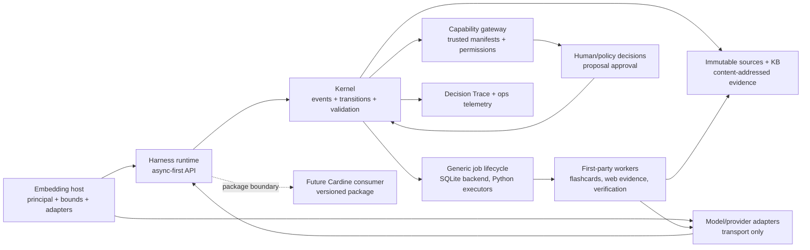

# Study Agent Harness Context Map

This map shows ownership and approved boundaries. It distinguishes what is
implemented now from the target shape; it is not a copy of module rosters.
The accepted behavior sources are [ADR-0001](docs/decisions/ADR-0001--oss-harness-only.md),
[ADR-0002](docs/decisions/ADR-0002--event-state-skills-playbooks.md),
[ADR-0004](docs/decisions/ADR-0004--adaptive-tutor-host-boundary.md),
[ADR-0008](docs/decisions/ADR-0008--closed-pedagogical-profiles-and-artifact-proposals.md),
and [ADR-0014](docs/decisions/ADR-0014--kb-v02-identity-compatibility-and-replay.md).

## Current

- The project is an Apache-2.0, provider-neutral Python harness with an
  event-sourced state kernel, immutable source/evidence contracts, a bounded
  `TutorHostRunner`, and a capability gateway. The implementation owners are
  [`src/study_agent/domain/`](src/study_agent/domain/),
  [`src/study_agent/application/`](src/study_agent/application/), and
  [`src/study_agent/capabilities/`](src/study_agent/capabilities/).
- KB v0.2 identity, compatibility, and replay rules are accepted; the
  knowledge package and its spec own details. See
  [`docs/specs/kb-v0-2-retrieval-architecture.md`](docs/specs/kb-v0-2-retrieval-architecture.md).
- Artifact proposals, closed pedagogical profiles, assessment contracts,
  recall, optional FSRS, capability-gap feedback, and local PDF/Markdown
  workarounds exist as bounded areas. Their source owners are the corresponding
  packages under [`src/study_agent/`](src/study_agent/) and the accepted ADRs.
- The reference CLI and browser are demonstration/reference hosts, not the
  production composition boundary. See [`src/study_agent/cli/`](src/study_agent/cli/)
  and [`src/study_agent/demo/`](src/study_agent/demo/).

## Approved Target

- Keep the kernel dependency-light and free of Pi/runtime vendoring. The host
  supplies model adapters and storage; the harness owns schemas, transitions,
  validation, and trust boundaries.
- Make the public API async-first, with a sync convenience wrapper over the
  same runtime. Tool registration is explicit; trusted plugins are namespaced,
  manifested, and permissioned.
- Keep read-only tools callable, while capabilities orchestrate durable effects
  through proposals and explicit human or injected policy decisions.
- Let the kernel own generic job/workflow lifecycle. SQLite is the durable
  built-in job backend and Python executors run work; a future distributed
  queue can implement the same port.
- Ship installable first-party workers for hierarchical flashcard generation,
  quarantined web evidence brokering, and sealed synthetic verification. A
  deterministic coordinator shards bounded work; review and deterministic
  assembly remain separate.
- Record an auditable canonical Decision Trace of the path taken. Keep full
  redacted payloads in diagnostic-local operational storage only, with no
  default remote telemetry and optional OpenTelemetry integration.
- Provide offline fixture evals and opt-in live comparisons against the
  recommended `gpt-5.6-luna` baseline. Candidate models, including DeepSeek V4
  Flash, are eval-gated rather than globally blocked.
- Publish a versioned package for downstream consumers such as Cardine; do not
  copy harness source into the product.

## Gap

- The local repository does not yet compose a real model → host runner →
  capability gateway path end to end; the current proof uses bounded/reference
  composition.
- The repository already contains retry-stable isolated worker orchestration,
  flashcard fan-out, and exam-analysis foundations. The gap is the target-grade
  durable job kernel, observability surface, and job-backed hierarchical
  flashcard, web-evidence, and sealed-verification compositions; existing
  SQLite adapters and operational stores do not provide that assembly yet.
- The browser shell remains an offline/reference surface. Online research stays
  a gap until a quarantined evidence port and admission flow are implemented.
- Sealed assessment generation, the separate coverage reviewer, and stale-input
  targeted regeneration require the approved workflow but are not a claim of
  complete production behavior today.
- Cross-user approvals and sharing remain out of scope; one learner approval
  boundary is the current contract.

See [`ROADMAP.md`](ROADMAP.md) for the public sequence and non-goals.
