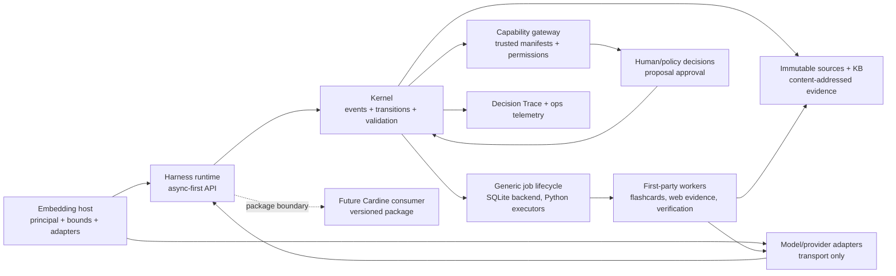

# Context Pack: Harness Future Runtime Features

Date: 2026-08-09
Run ID: `20260809-harness-future-runtime`
Project: `/Users/ebrahimabdelwahed/Desktop/Med/Lezioni/Audio_to_Sbobina/.worktrees/study-agent-harness-integration`

## Purpose

This pack gives the orchestrator and future workers enough repository context to create a precise spec and scoped task graph.

## Files Read

- `AGENTS.md`
- `README.md`
- `pyproject.toml`
- `docs/archive/build-week/README.md`
- `docs/archive/build-week/proof/README.md`
- `specs/future-runtime/README.md`
- `CONTEXT.md`
- `CONTEXT-MAP.md`
- `dev/handoffs/2026-08-09-2200--cardine-harness--specs-and-beads-design--handoff.md`

## `AGENTS.md`

```text
# AI Agent Instructions

Study Agent Harness is an embeddable, provider-neutral study runtime. Preserve
its canonical state, source-grounding, replay, approval, and recovery contracts.

## Required Git Workflow

- Treat the primary checkout and shared worktrees as read-only.
- Every task that changes files must use a dedicated Git worktree and a
  `codex/<task>` branch. Do not create a nested worktree when the task is already
  running in its own dedicated worktree.
- Start ordinary work from the latest `origin/main`. Use another base only when
  the task explicitly requires integration or recovery from that lineage.
- Inspect `git status` and `git worktree list` before editing. Never overwrite,
  stash, commit, or clean changes that belong to another user or agent.
- Keep commits intentional and reviewable. Do not mix unrelated changes.
- Run the narrowest relevant verification first, followed by broader project
  gates when practical.
- Push the task branch and open a pull request targeting `main` after
  verification. Never push directly to `main`.
- If push or pull-request creation is unavailable, stop with a verified local
  branch and commits ready, and document the exact blocker.

## Engineering Rules

- Be conservative with existing behavior and public contracts.
- Search the codebase and existing `dev/` memory before designing or editing.
- Prefer small, modular changes. Do not refactor unrelated code.
- Do not introduce dependencies unless they materially reduce risk or
  complexity. Keep provider, parser, scheduler, and observability integrations
  optional when possible.
- Canonical facts and human decisions belong to the harness. Model output is
  untrusted and cannot silently approve itself or mutate canonical state.
- Keep provider transports, persistence adapters, UI, and policy owners behind
  explicit ports. Do not leak their types into neutral domain contracts.
- Preserve deterministic replay: model calls and operational logs are not
  canonical state.
- Never hardcode credentials. Use environment references or host-provided secret
  resolvers.

## Natural-Language Processing

- The repository default for summarization, extraction, classification,
  rewriting, flashcard generation, quiz generation, explanations, semantic
  transformation, study assistance, and search enrichment is `gpt-5.6-luna`.
- Route model calls through dedicated adapters and `OPENAI_API_KEY` environment
  references. Do not use the `gpt-5.6` family alias.
- UI and domain components must not call model APIs directly.
- Prompts that affect study outputs must be versioned or documented and covered
  by loading, error, and evaluation paths.

## Development Memory

- Read `dev/index.md` when present, then search `dev/plans/`, `dev/logs/`,
  `dev/notes/`, `dev/decisions/`, and `dev/handoffs/` for relevant context.
- Create a plan before multi-file, architectural, uncertain, integration, or
  high-risk work.
- Record exact verification commands and outcomes in a log when work completes,
  fails, or remains partial.
- Create a handoff when work remains incomplete or context must carry forward.
- Keep memory granular and use
  `YYYY-MM-DD-HHMM--area--task--type.md` filenames.

## Verification

- Prefer the project commands declared in `pyproject.toml` and CI.
- Run focused tests before the full suite.
- Validate lint, strict typing, tests, and package build for substantive changes.
- Document pre-existing failures without hiding or weakening them.
- After medium-risk changes, obtain one independent semantic correctness and
  regression review. Use a security review for untrusted input, filesystem,
  networking, credentials, or sensitive serialization.
```

## `README.md`

```text
# Study Agent Harness

`study-agent-harness` is an alpha Python library and reference CLI for building
source-grounded study agents. It provides a local, provider-neutral execution
core: the host supplies trusted authority and the model may propose only
schema-bounded actions.

The harness is designed to sit behind different agent hosts, models, providers,
and user interfaces without making any of them canonical. It has no runtime
dependency on a hosted product or agent SDK.

## Core principles

The append-only domain event stream is canonical state. Course, source, session,
artifact, assessment, and knowledge projections are derived read models. SQLite
checkpoints, the lexical index, local configuration, and filesystem layout are
operational state: they support recovery and performance but do not redefine the
study record.

Versioned skills describe capabilities, and playbooks compose study behaviour.
Model adapters translate technical protocols only; they do not own prompts,
policy, authority, or domain state. An embedding host creates trusted execution
context separately from model-proposed tool arguments.

The architectural rationale and compatibility rules are recorded in
[`docs/decisions/`](docs/decisions/). The original v0.1 specifications remain in
[`docs/specs/`](docs/specs/) as design history.

## Install

Python 3.12 or newer is required. The core runtime uses only the standard
library.

CI verifies Python 3.12 and 3.13 on Ubuntu. Other operating systems are expected
to work, but are not yet a release-support promise.

From a checkout:

```bash
python3.12 -m venv .venv
source .venv/bin/activate
python -m pip install -e .
study-agent --version
study-agent --help
```

Development tools are isolated in an optional extra:

```bash
python -m pip install -e '.[dev]'
```

## First offline workflow

The core is an installed library and CLI, not a server. Create a local
repository, add a course and a UTF-8 Markdown source, then verify replay and
retrieval without credentials or network access:

```bash
study-agent init ./my-study-repository
cd ./my-study-repository
printf '# Example notes\nThe aortic valve opens into the aorta.\n' > notes.md
study-agent --repository . course create \
  --course-id example-course \
  --title "Example course" \
  --learning-goal "Explain the core concepts"
study-agent --repository . source add example-course notes.md \
  --source-id example-notes
study-agent --repository . doctor
```

`doctor` should report `status: ok`, `event_replay: ok`, and
`retrieval_rebuild: ok`. The default repository has no model configured, so
replay, retrieval, export, and diagnostics remain offline. `ask` requires an
explicitly configured model adapter.

Command help is the source of truth for arguments. Add the global `--json` flag
for a single machine-clean success or safe error document on stdout.

## Public integration points

There are two supported alpha entry points:

- `study-agent` is the reference process boundary. Run
  `study-agent --json describe` to discover commands, effects, retry guidance,
  tool manifests, contract versions, and unavailable capabilities.
- `study_agent.tools` is the low-level Python integration surface for immutable
  tool contracts, manifests, schema validation, trusted owner composition, and
  `StudyToolRegistry` invocation.

The [integration guide](docs/integrations.md) explains how an agent host binds
trusted execution context and canonical service owners without duplicating
business logic. The [external-agent example](docs/examples/external_agent.py)
demonstrates the installed CLI boundary without depending on an agent SDK.

This is not yet a general-purpose stable Python SDK. Repository composition is
a reference implementation, not a promised top-level facade. Recall scheduling
is available through the optional `recall` extra and reports an explicit
availability state when its policy adapter is not configured.

### Agent-operated setup

Automation should negotiate the machine contract and extract the versioned
operator workflow from the installed distribution:

```bash
study-agent --json describe
study-agent --json operator skill \
  --output ./agent-skills/study-agent-operator/SKILL.md
```

Verify the extracted file against the fingerprint returned by `describe`. Use
stable course, source, session, and idempotency identities. For `ask`, supply an
explicit `--session-id` and `--idempotency-key`; after lost output, retry the
same question with the same identities.

For desired-state setup, lifecycle manifests provide validation, planning, and
fingerprint-gated application while leaving canonical mutations with their
existing services:

```bash
study-agent --json manifest validate study-agent.manifest.json
study-agent --json manifest plan study-agent.manifest.json
study-agent --json manifest apply study-agent.manifest.json \
  --expect-plan PLAN_SHA256
```

Initialization is a separate first convergence step. Replan after any manifest,
source, or canonical-state change.

## Bundled offline demo

Run the deterministic tutor-host trace from any directory:

```bash
study-agent-demo "I have ten minutes. Help me understand heart valves."
```

The demo uses a bundled sanitized Markdown fixture and an in-process recorded
provider response. It exercises the real tutor runner, trusted-context boundary,
evidence refresh, and suspension/resumption contracts without an API key, model
SDK, local repository, or network call. Add `--json` for its inspectable trace.

It is a contract demonstration, not a live-provider benchmark and not a
substitute for the repository workflow above.

## Models and credentials

The bundled network adapter speaks an OpenAI-compatible HTTP protocol. Its
configuration stores technical values plus the name of a credential environment
variable. The credential value is read only when the repository is opened and
is never written to repository configuration.

Never put an API key in a model setting, committed file, transcript, fixture, or
export. Use `study-agent init --help` for adapter configuration. The
[reference tutor-host guide](docs/reference-tutor-host.md) documents optional
provider-backed execution, privacy behaviour, retries, costs, and limitations.

## Recovery and portable export

Recovery starts from current evidence: inspect status, obtain a fresh plan, and
apply only its reported fingerprint. Source ingestion commits the canonical
revision before rebuilding the discardable retrieval index; an index failure is
reported as a recoverable operational error rather than concealed or rolled
back.

Export is a deterministic, credential-free view of canonical course state.
Repeated exports at the same event high-water mark are byte-identical. The
allowlisted bundle excludes credentials, provider payloads, host paths, run
checkpoints, blob references, and source bytes. Its manifest is an integrity
boundary; the event stream remains the recovery boundary.

## Verify a checkout

Run the offline quality gates:

```bash
.venv/bin/python -m pytest
.venv/bin/python -m ruff check .
.venv/bin/python -m mypy
```

Release acceptance additionally requires wheel and source-distribution content
checks, a clean-wheel install, CLI/demo/discovery/operator-skill smokes, and the
external-agent example. The exact local procedure lives in the
[release checklist](docs/maintainer/release-checklist.md).

Network smoke tests are opt-in. Default tests must not require credentials, a
provider SDK, or a hosted service.

## Context and roadmap

The canonical glossary and implemented invariants live in
[`CONTEXT.md`](CONTEXT.md). [`CONTEXT-MAP.md`](CONTEXT-MAP.md) separates current
behavior, approved target, and implementation gaps. [`ROADMAP.md`](ROADMAP.md)
is the single public home for ordered future work and non-goals.

## Status and project policies

Version 0.2.0 is alpha software and its public API is not stable. This checkout
is being prepared as a source release candidate; this work does not create a
tag, publish a package, or make an online release.

The project is available under the [Apache License 2.0](LICENSE). See
[`CONTRIBUTING.md`](CONTRIBUTING.md), [`SECURITY.md`](SECURITY.md),
[`SUPPORT.md`](SUPPORT.md), and [`GOVERNANCE.md`](GOVERNANCE.md) for project
policies, and [`CHANGELOG.md`](CHANGELOG.md) for release-facing changes.

The original Build Week submission material is preserved under
[`docs/archive/build-week/`](docs/archive/build-week/README.md). It is historical
evidence, not current installation or release guidance.
```

## `pyproject.toml`

```text
[build-system]
requires = ["setuptools>=77"]
build-backend = "setuptools.build_meta"

[project]
name = "study-agent-harness"
version = "0.2.0"
description = "Provider-neutral, event-sourced study-agent harness"
keywords = ["study agents", "tutoring", "event sourcing", "replay"]
readme = "README.md"
requires-python = ">=3.12"
license = "Apache-2.0"
authors = [{ name = "Ebrahim Abdelwahed" }]
classifiers = [
  "Development Status :: 3 - Alpha",
  "Intended Audience :: Developers",
  "Topic :: Software Development :: Libraries",
  "Operating System :: OS Independent",
  "Programming Language :: Python :: 3",
  "Programming Language :: Python :: 3.12",
  "Programming Language :: Python :: 3.13",
  "Typing :: Typed",
]
dependencies = []

[project.urls]
Homepage = "https://github.com/EbrahimAbdelwahed/study-agent-harness"
Documentation = "https://github.com/EbrahimAbdelwahed/study-agent-harness#readme"
Changelog = "https://github.com/EbrahimAbdelwahed/study-agent-harness/blob/main/CHANGELOG.md"
Issues = "https://github.com/EbrahimAbdelwahed/study-agent-harness/issues"
Source = "https://github.com/EbrahimAbdelwahed/study-agent-harness"

[project.scripts]
study-agent = "study_agent.cli.main:main"
study-agent-demo = "study_agent.demo.anatomy:main"
study-agent-shell = "study_agent.demo.product_shell:main"
study-agent-shell-web = "study_agent.demo.browser:main"

[project.optional-dependencies]
dev = [
  "mypy>=1.15",
  "pytest>=8.3",
  "ruff>=0.11",
]
openai = ["openai>=2.46,<3"]
recall = ["fsrs==6.3.1"]
pdf = ["pypdf==6.14.2"]

[tool.setuptools.packages.find]
where = ["src"]

[tool.setuptools.package-data]
study_agent = ["py.typed"]
"study_agent.demo" = ["fixtures/*.md", "browser.html"]
"study_agent.operator_skill" = ["SKILL.md"]

[tool.pytest.ini_options]
addopts = "-ra"
testpaths = ["tests"]
pythonpath = ["src", "."]

[tool.mypy]
python_version = "3.12"
strict = true
files = ["src", "tests"]

[tool.ruff]
target-version = "py312"
line-length = 100

[tool.ruff.lint]
select = ["E", "F", "I", "UP", "B", "SIM", "RUF"]
```

## `docs/archive/build-week/README.md`

```text
# Build Week archive

This directory preserves the lightweight historical record of the OpenAI Build
Week work that led to Study Agent Harness. It is an archive, not the current
product guide.

- `proof/`: static, locally inspectable launch-proof pages.
- `plans/`, `logs/`, and `handoffs/`: contemporaneous planning and execution
  record.
- The remaining files: submission narrative, captions, narration, and montage
  material.

The original media are intentionally kept in a separate, non-versioned archive.
They were moved on 2026-08-02 without transcoding or deletion. The following
SHA-256 values identify the large deliverables independently of their local
storage path:

```text
1564a37b6ff6c1188844e169e98eeaccfbf39d3c5e2aae76e523e6ad88f71bfa  Study Agent Harness - Launch Video with Chunked Voiceover.mp4
0955a3af662e78528fa6a8a48cbbec6d0f1f8384253f20c89bb6a3c1bf6d88e3  Study Agent Harness - Launch Video with Voiceover - Slow Backup.mp4
67b808756f223a17b2bc6b40c98dc6dfc8da901219e510ef039a16d37765d62e3  video/study-agent-build-week-presentation-final-silent.mp4
d051aebf3f1dee91bfdd9c4a61bf84f51c71471a862699c7dccc600b36437947  Study Agent Harness - Launch Video under 3 Minutes.mp4
fc2fae9fa35e37dc6d5e62f6c63b2e6b7bb12fb5383d945a4b90ba3696091d0f  Study Agent Harness - Launch Video with Voiceover.mp4
a2e0aae0c90b26158209cd434e5affc24d97cbdd2a8078710937878e8004fb31  Study Agent Harness - Launch Video.mp4
816fa20b1c370e7cc18133bc2ede126a0ff1339deae337ba3f8c32b1deb834c6  Study Agent Harness - Voiceover Jerry B.mp3
```

Historical documents may retain their original `docs/build-week-*` or `output/`
paths as contemporaneous evidence; the archive locations above are canonical.
```

## `docs/archive/build-week/proof/README.md`

```text
# Build Week launch proof

This is a local, non-product visualizer for the deterministic offline anatomy
trace. Its displayed source, evidence, context, status, and parity values are a
checked-in projection of:

```bash
study-agent-demo --json
```

Serve this directory with a static HTTP server. The default view plays an
80-second, six-chapter sequence designed for the cue windows in
`docs/archive/build-week/build-week-narration-final.txt`. `?scene=1` through `?scene=6` freeze the
corresponding chapter for deterministic visual QA.

The proof is a product-direction visualization backed by the real offline trace.
It does not call a provider or add a new harness contract.

The optional Codex + Flywheel companion is `flywheel-index.html`. It plays a
deterministic 39-second, six-chapter trace of how the project used Codex:
human-approved spec → dependency-aware beads → bounded worker → real offline
CLI proof → risk-proportionate tests/reviews → durable handoff. It deliberately
uses a distinct demonstrative process interface, not the study-harness UI. Use
`?scene=1` through `?scene=6` to freeze a chapter for capture. Its terminal box
is a legible subset of the real `study-agent-demo` output; the labels and
evidence paths are projections of checked-in artifacts.
```

## `specs/future-runtime/README.md`

```text
# Harness Future Runtime Features

Status: ready for implementation planning

Date: 2026-08-09

Owning repository: Study Agent Harness

## Outcome

Add the provider-neutral runtime waves approved in the Cardine/Harness handoff:
one durable Job lifecycle, a separate minimal Decision Trace, hierarchical
flashcard Jobs, quarantined web evidence, and sealed Synthetic Verification.
The package remains local-first, offline-verifiable, and independent of
Cardine. Cardine receives only released portable contracts and presentation
receipts; it owns academic authority, attempts, grades, contests, curriculum,
learner estimates, and planning.

## Scope firewall

Harness owns Job/lease/attempt/retry mechanics, executor checkpoints,
provider-neutral evidence transport and quarantine, portable exam-generation
schemas, validation, replay, and trust boundaries. Harness does not own
curriculum meaning, mastery, readiness, study planning, exam authenticity,
grades, contests, UI, auth, or deployment. All host academic references are
opaque typed IDs. A model is an untrusted provider and can never approve,
admit evidence, release content, or commit a canonical product fact.

The sole outer lifecycle is:

```text
QUEUED -> RUNNING -> SUSPENDED | SUCCEEDED | FAILED | CANCELLED | STALE
```

Lease and heartbeat are RUNNING metadata. Retries create monotonic attempts
under the same Job. Existing playbook and lesson-worker checkpoints are
subordinate proofs, not a second lifecycle owner.

## Slice graph

```text
HR-01 -> HR-02 -> HR-03 -> HR-04 -> HR-05
                       |
                       +-> HR-06 -> HR-07
                       +-> HR-08 -> HR-09
                       +-> HR-10 -> HR-11
HR-05 -> shared RuntimeReleaseGate -> publishes 1.1
HR-07 -> shared RuntimeReleaseGate -> publishes 1.2
HR-09 -> shared RuntimeReleaseGate -> publishes 1.3
HR-11 -> HR-12 -> shared RuntimeReleaseGate -> publishes 1.4/final aggregate
```

Risk-first order is intentional: HR-01 installs the policy firewall and
adversarial leak oracles before runtime implementations; HR-05 proves lifecycle
convergence before old stores are removed; HR-10 proves sealed-content
non-disclosure before generation exists.

## Release waves

| Release | Slice and gate producer | Shipped contract |
| --- | --- | --- |
| 1.1 | HR-01–HR-05, published by HR-05 through `RuntimeReleaseGate` | JobStore, executor recovery, and minimal Decision Trace |
| 1.2 | HR-06–HR-07, published by HR-07 through the same `RuntimeReleaseGate` | Hierarchical flashcard Jobs and proposal-only assembly |
| 1.3 | HR-08–HR-09, published by HR-09 through the same `RuntimeReleaseGate` | Quarantined WebEvidencePort and explicit admission |
| 1.4 | HR-10–HR-12, final aggregate published only by HR-12 through `RuntimeReleaseGate` | Sealed Synthetic Verification, offline evals, and package release |

The base package remains dependency-free. The scripted web connector is in
the base runtime. OpenAI Responses `web_search` and OpenTelemetry are optional
adapters. No live network call is part of the default verification path.

## Program orchestration gate

Runtime implementation may start only after PF-11 has promoted the stable
facade and CA-10 has supplied its copied-core-removal/co-install evidence.
This is a program-level ordering gate recorded by the orchestrator; it is not
a Harness source, import, package, schema, or test dependency. HR slices must
continue to name only released Harness contracts and generic ports.

## Shared contracts and invariants

- Every durable command carries an idempotency key. Same key and canonical
  input converge; same key and different bytes return conflict.
- Job identity is derived from capability/version, authority scope,
  idempotency key, and input fingerprints. Child identity also includes parent,
  position, and task fingerprint. Same identity with different bytes conflicts.
- Defaults are fixed: 60-second lease, 20-second heartbeat, fencing on expiry,
  global and per-workflow concurrency 8, depth 1, maximum 64 children, FIFO
  deterministic claims, at-least-once execution, and owner-idempotent exactly
  once canonical commit.
- Retry defaults are maximum three attempts, 1/2/4 second exponential
  backoff, +/-20% jitter, and 30-second cap. Only timeout, rate limit,
  provider-5xx, or declared transient failures retry.
- Cancellation completes at a safe point. A committed event is never rolled
  back. Suspended Jobs hold no lease; resume tokens bind Job, attempt,
  checkpoint, authority, input, and dependency fingerprints.
- Decision Trace is separate append-only audit evidence. It records observable
  IDs, transitions, validators, safe errors, fingerprints, and timestamps; it
  never stores prompts, excerpts, outputs, secrets, raw personal identity, or
  chain-of-thought. Redacted diagnostics expire after 14 days; optional
  telemetry loss cannot change execution.
- Web candidates are quarantined and untrusted. The broker cannot admit.
  Admission of an exact snapshot by HUMAN or trusted SERVICE creates an
  immutable Source Revision with hash, URL, time, connector, query,
  provenance, policy, and decision.
- Sealed means application authority, not encryption. Lists, search, export,
  traces, errors, and pre-attempt presentation contain no sealed questions or
  answers.
- Synthetic Verification requires approved profile and accepted plan,
  independent coverage review, deterministic release, complete required
  coverage, and no unsupported claims. Generator output never self-reviews or
  self-releases.
- No Job, trace, diagnostic, cache, checkpoint, or operational run record is
  learner truth or enters a product projection/export.

## Review map

Current implementation seams to preserve are `src/study_agent/lifecycle/`,
`src/study_agent/workers/`, `src/study_agent/flashcards/`,
`src/study_agent/capabilities/`, `src/study_agent/artifacts/`,
`src/study_agent/adapters/sqlite/`, and `src/study_agent/ports/`. New seams are
the JobStore/Executor ports, TraceStore, WebEvidencePort, sealed verification
contracts, and their SQLite/scripted adapters. Each slice names its exact
review files and tests.

## Global verification

Run the narrow slice command first, then from the Harness root:

```bash
.venv/bin/python -m pytest
.venv/bin/python -m ruff check .
.venv/bin/python -m mypy
git diff --check
```

For each release wave, build and test the artifact in a clean Python 3.12 and
3.13 environment. The wheel must contain no Cardine references, no required
provider dependency, and no hidden entry point. Offline tests must run without
credentials or network. Live connector and model comparisons are opt-in.

## Transition removals

HR-05 removes only the generic lifecycle, playbook, and GenerationWorker outer
transitions after parity proves Job recovery, suspension, continuation, and
gateway outcomes. HR-07 removes only the flashcard LessonWorker transitions
after hierarchical flashcard parity. No temporary adapter survives the named
last consumer. Diagnostic payloads never become Trace; Trace never becomes a
domain event. Candidate web content never becomes a Source Revision without
admission. Sealed content never enters generic views.

## Residual risks

Lease races, duplicate delivery, and exactly-once canonical commit remain
possible failure modes and require the adversarial fixtures in HR-02/03.
Trace redaction can regress as fields evolve; HR-04 owns schema deny-lists and
scanners. Web connectors can return prompt-injection or false evidence; HR-08/09
keep output untrusted and quarantined. Novelty thresholds can over-regenerate;
HR-10/11 suspend after two failed regenerations and expose no content. SQLite
is local single-writer; distributed queue behavior is not part of these waves.

## Next Agent Prompt

You are implementing the Harness Future Runtime Features spec. Start with
`slices/HR-01-contract-firewall.md`; add only the contract and adversarial
fixtures named there, then run its exact verification command and the global
offline checks. Do not add Cardine policy, a second lifecycle owner, live
network defaults, or sealed-content serialization. Continue slices in graph
order, recording any changed evidence in this README before ending your pass.
Update the status, next pickup point, and checklist here before handing off.

Global checklist:

- [ ] HR-01–HR-05 and shared release gate publishes 1.1
- [ ] HR-06–HR-07 and shared release gate publishes 1.2
- [ ] HR-08–HR-09 and shared release gate publishes 1.3
- [ ] HR-10–HR-12 and HR-12-only final aggregate publishes 1.4
- [ ] Program gate records PF-11 and CA-10 evidence before runtime start
- [ ] Remove every temporary lifecycle seam at its named removal slice
- [ ] Re-run full offline suite on Python 3.12 and 3.13
```

## `CONTEXT.md`

```text
# Study Agent Harness Context

This is the concise vocabulary and invariant sheet for the harness. The
approved behavior is defined by the accepted decisions in
[`docs/decisions/`](docs/decisions/) and the current implementation in
[`src/study_agent/`](src/study_agent/); this file names the boundaries without
duplicating their registries.

## Vocabulary

- **Harness** — the provider-neutral, local-first execution layer. It owns
  schemas, transitions, validation, replay, and trust boundaries; it is not a
  hosted product or a chatbot UI.
- **Host** — the embedding application that supplies a principal, repository,
  session, model adapter, and storage, and that bounds the adaptive loop.
- **Kernel** — canonical domain state and generic lifecycle rules: event
  append, projections, capability dispatch, validation, proposals, approvals,
  jobs, and observability.
- **Capability** — a versioned, discoverable study operation with schemas,
  policy, validators, provenance, idempotency, and explicit write permissions.
- **Tool** — a callable interface exposed to a host or capability. The current
  registry includes both queries and a bounded note command. The approved
  target keeps queries directly callable and routes new durable effects through
  permissioned capabilities and proposals.
- **Worker** — an execution component for a bounded capability. Workers do not
  own canonical policy or state; they return validated results or proposals to
  the kernel.
- **Source** — immutable, content-addressed learner material. A source
  revision, normalized substrate, citation, and derived knowledge-base
  projection have separate identities.
- **Evidence** — source-bound support that retains citation, lineage, and trust
  information. Candidate web evidence is quarantined until admitted.
- **Artifact proposal** — a versioned generated study artifact awaiting an
  explicit decision. Generation and validation never imply acceptance.
- **Reference Exam** — an immutable, approved authentic past exam or
  teacher-authored simulation used as evidence about assessment style. It is
  never reused as learner-facing generated content.
- **Exam Profile** — an approved, versioned description of assessment scope,
  topic mix, question types, detail, and phrasing, derived from a syllabus and
  compatible Reference Exams.
- **Generation Plan** — the learner-visible proposal describing what a
  Synthetic Verification will generate and why, without revealing its sealed
  questions.
- **Synthetic Verification** — a novel, sealed assessment generated from an
  approved Exam Profile and Generation Plan. Its questions become visible only
  during an attempt.
- **Decision Trace (approved target)** — the canonical minimal record of
  observable choices, outcomes, validators, and transitions. It is an audit
  trail, not model chain-of-thought.
- **Operational state** — checkpoints, indexes, job leases, metrics, and
  diagnostic payloads used for recovery or debugging. It is not canonical
  learner truth.

## Implemented invariants

1. The append-only event stream is canonical; projections, snapshots, and
   indexes are rebuildable and never independent authorities.
2. Models and providers propose or translate transport. They cannot select
   identity, permissions, policy, parentage, or canonical outcomes.
3. Skills and playbooks are model-independent. The host owns bounded adaptive
   choice; the kernel owns capability execution and validation.
4. Unknown, malformed, stale, unauthorized, or ungrounded input fails closed.
   Retries are bounded and never silently mutate canonical history.
5. Sources remain immutable and citable. Derived synthesis preserves claim
   lineage and trust and never becomes a primary source.
6. Generated artifacts remain proposals until an explicit authorized decision;
   generation and validation do not imply acceptance.
7. The kernel is dependency-light and model-neutral. It has no Pi/runtime
   dependency or vendored agent framework; hosts bring adapters and storage.
8. Provider-neutral service surfaces are asynchronous where execution can
   suspend. The reference SQLite adapter is local and single-writer; worker
   execution remains behind ports.
9. Stored execution proofs describe observable inputs, outputs, validations,
   and transitions; they do not request or store private chain-of-thought.
10. A single learner approval boundary is in scope. Cross-user sharing,
    organizations, billing, hosted operations, and product UI are deferred.

## Approved target constraints

- A sync convenience API must wrap the same async implementation; it must not
  become a second runtime.
- Synthetic Verification content remains sealed until an attempt, and required
  coverage gaps block release.
- A canonical Decision Trace will record the observable path taken. Full
  redacted payloads remain diagnostic-local operational data, retained for 14
  days by default, with no default remote telemetry.

## Source owners

Use the owning module or decision rather than copying its roster here:

- Domain values and event contracts: [`src/study_agent/domain/`](src/study_agent/domain/)
  and [ADR-0002](docs/decisions/ADR-0002--event-state-skills-playbooks.md).
- Host boundary and capability gateway: [`src/study_agent/application/`](src/study_agent/application/),
  [`src/study_agent/capabilities/`](src/study_agent/capabilities/), and
  [ADR-0004](docs/decisions/ADR-0004--adaptive-tutor-host-boundary.md).
- Immutable knowledge-base identity and replay: [`src/study_agent/knowledge/`](src/study_agent/knowledge/),
  [`docs/specs/kb-v0-2-retrieval-architecture.md`](docs/specs/kb-v0-2-retrieval-architecture.md),
  and [ADR-0014](docs/decisions/ADR-0014--kb-v02-identity-compatibility-and-replay.md).
- Artifact and pedagogical policy: [`src/study_agent/artifacts/`](src/study_agent/artifacts/),
  [`src/study_agent/assessments/`](src/study_agent/assessments/), and
  [ADR-0008](docs/decisions/ADR-0008--closed-pedagogical-profiles-and-artifact-proposals.md).
- Provider and persistence adapters: [`src/study_agent/adapters/`](src/study_agent/adapters/);
  they remain technical boundaries, not behavior owners.

For the ordered future work, see [`ROADMAP.md`](ROADMAP.md). For ownership and
current-versus-target status, see [`CONTEXT-MAP.md`](CONTEXT-MAP.md).
```

## `CONTEXT-MAP.md`

```text
# Study Agent Harness Context Map

This map shows ownership and approved boundaries. It distinguishes what is
implemented now from the target shape; it is not a copy of module rosters.
The accepted behavior sources are [ADR-0001](docs/decisions/ADR-0001--oss-harness-only.md),
[ADR-0002](docs/decisions/ADR-0002--event-state-skills-playbooks.md),
[ADR-0004](docs/decisions/ADR-0004--adaptive-tutor-host-boundary.md),
[ADR-0008](docs/decisions/ADR-0008--closed-pedagogical-profiles-and-artifact-proposals.md),
and [ADR-0014](docs/decisions/ADR-0014--kb-v02-identity-compatibility-and-replay.md).



## Current

- The project is an Apache-2.0, provider-neutral Python harness with an
  event-sourced state kernel, immutable source/evidence contracts, a bounded
  `TutorHostRunner`, and a capability gateway. The implementation owners are
  [`src/study_agent/domain/`](src/study_agent/domain/),
  [`src/study_agent/application/`](src/study_agent/application/), and
  [`src/study_agent/capabilities/`](src/study_agent/capabilities/).
- KB v0.2 identity, compatibility, and replay rules are accepted; the
  knowledge package and its spec own details. See
  [`docs/specs/kb-v0-2-retrieval-architecture.md`](docs/specs/kb-v0-2-retrieval-architecture.md).
- Artifact proposals, closed pedagogical profiles, assessment contracts,
  recall, optional FSRS, capability-gap feedback, and local PDF/Markdown
  workarounds exist as bounded areas. Their source owners are the corresponding
  packages under [`src/study_agent/`](src/study_agent/) and the accepted ADRs.
- The reference CLI and browser are demonstration/reference hosts, not the
  production composition boundary. See [`src/study_agent/cli/`](src/study_agent/cli/)
  and [`src/study_agent/demo/`](src/study_agent/demo/).

## Approved Target

- Keep the kernel dependency-light and free of Pi/runtime vendoring. The host
  supplies model adapters and storage; the harness owns schemas, transitions,
  validation, and trust boundaries.
- Make the public API async-first, with a sync convenience wrapper over the
  same runtime. Tool registration is explicit; trusted plugins are namespaced,
  manifested, and permissioned.
- Keep read-only tools callable, while capabilities orchestrate durable effects
  through proposals and explicit human or injected policy decisions.
- Let the kernel own generic job/workflow lifecycle. SQLite is the durable
  built-in job backend and Python executors run work; a future distributed
  queue can implement the same port.
- Ship installable first-party workers for hierarchical flashcard generation,
  quarantined web evidence brokering, and sealed synthetic verification. A
  deterministic coordinator shards bounded work; review and deterministic
  assembly remain separate.
- Record an auditable canonical Decision Trace of the path taken. Keep full
  redacted payloads in diagnostic-local operational storage only, with no
  default remote telemetry and optional OpenTelemetry integration.
- Provide offline fixture evals and opt-in live comparisons against the
  recommended `gpt-5.6-luna` baseline. Candidate models, including DeepSeek V4
  Flash, are eval-gated rather than globally blocked.
- Publish a versioned package for downstream consumers such as Cardine; do not
  copy harness source into the product.

## Gap

- The local repository does not yet compose a real model → host runner →
  capability gateway path end to end; the current proof uses bounded/reference
  composition.
- The repository already contains retry-stable isolated worker orchestration,
  flashcard fan-out, and exam-analysis foundations. The gap is the target-grade
  durable job kernel, observability surface, and job-backed hierarchical
  flashcard, web-evidence, and sealed-verification compositions; existing
  SQLite adapters and operational stores do not provide that assembly yet.
- The browser shell remains an offline/reference surface. Online research stays
  a gap until a quarantined evidence port and admission flow are implemented.
- Sealed assessment generation, the separate coverage reviewer, and stale-input
  targeted regeneration require the approved workflow but are not a claim of
  complete production behavior today.
- Cross-user approvals and sharing remain out of scope; one learner approval
  boundary is the current contract.

See [`ROADMAP.md`](ROADMAP.md) for the public sequence and non-goals.
```

## `dev/handoffs/2026-08-09-2200--cardine-harness--specs-and-beads-design--handoff.md`

```text
# Handoff: Cardine / Study Agent Harness specs and beads design

Date: 2026-08-09 22:00
Area: Cardine, Study Agent Harness, package adoption, future implementation specs

## Current State

The user requested an overlap analysis between Cardine and Study Agent Harness,
followed by four execution-ready implementation specs and dependency-aware task
beads. The work is still in the grilling/decision-closure phase. No specs or
beads have been written yet.

The overlap analysis must use these documents as its semantic sources:

- Cardine `/Users/ebrahimabdelwahed/Desktop/Dev/cardine/CONTEXT-MAP.md`
- Cardine `/Users/ebrahimabdelwahed/Desktop/Dev/cardine/TECHNICAL-MAP.md`
- Cardine `/Users/ebrahimabdelwahed/Desktop/Dev/cardine/docs/domain/*/CONTEXT.md`
- Harness `/Users/ebrahimabdelwahed/Desktop/Med/Lezioni/Audio_to_Sbobina/.worktrees/study-agent-harness-integration/CONTEXT.md`
- Harness `/Users/ebrahimabdelwahed/Desktop/Med/Lezioni/Audio_to_Sbobina/.worktrees/study-agent-harness-integration/CONTEXT-MAP.md`

Do not use old specs or beads as authority for the semantic overlap. They may
be inspected later as historical implementation material after ownership and
contracts are fixed.

## Skills and Process

- The active interview follows
  `/Users/ebrahimabdelwahed/.codex/skills/grilling/SKILL.md`.
- Spec materialization must follow
  `/Users/ebrahimabdelwahed/.codex/skills/write-spec/SKILL.md`.
- Beads and worker briefs must follow the dedicated repo-local skill and its
  templates:
  - `/Users/ebrahimabdelwahed/Desktop/Med/20_Progetti/study-agent-devkit/skills/implementation-orchestrator/SKILL.md`
  - `/Users/ebrahimabdelwahed/Desktop/Med/20_Progetti/study-agent-devkit/templates/task-bead.md`
  - `/Users/ebrahimabdelwahed/Desktop/Med/20_Progetti/study-agent-devkit/templates/worker-brief.md`
- Every bead must be executable without redesign or TBDs, fit one fresh context,
  produce an observable independently verifiable outcome, name spec coverage
  and grilling evidence, and declare worker profile, context, allowed scope,
  acceptance criteria, verification, dependencies, and out-of-scope behavior.
- Wide migrations use `expand -> migrate -> contract`; every temporary seam has
  an explicit removal bead.
- The user wants all architecture questions resolved before bead creation; do
  not create architecture-closure beads.

## Approved Four-Spec Structure

Exactly four main specs will be created:

1. Harness — Package Foundation.
2. Cardine — Harness Adoption.
3. Harness — Future Runtime Features.
4. Cardine — Future Product Features.

Each spec lives in its owning repository and contains its own slices/beads.
There is no fifth cross-repository spec. Cross-repository dependencies are
unidirectional:

```text
Harness contract bead -> released package/contract version -> Cardine adapter bead -> Cardine product bead
```

Harness must never depend on Cardine.

## Approved Ownership Boundary

- Harness owns provider-neutral mechanisms and portable contracts.
- Cardine owns academic meaning, product policy, composition, UI, auth, and
  deployment.
- Harness owns immutable source identity/revisions/blob/citation mechanics;
  Cardine owns educational authority, currency, integrity, notices, and
  curriculum alignment.
- Harness owns generic artifact proposal/revision/decision lifecycle; Cardine
  owns artifact kinds, approval policy, substantial-revision meaning, and
  product effects.
- Harness owns portable Reference Exam, Exam Profile, Generation Plan, and
  Synthetic Verification schemas/workflow; Cardine owns academic authenticity,
  exam components, attempts, criteria, grades, contests, and profile approval.
- Harness owns generic recall ledger, scheduling port, and due view; Cardine
  owns eligibility, rating meaning, substantial-revision effects, and mapping
  Retention Observations into Learner Model inputs.
- Cardine is the only planner. It owns Study Plan, Next Activity, rationale,
  mastery/readiness use, and learner overrides. Harness only validates and
  executes the selected bounded capability.
- Curriculum and Learner Model remain entirely Cardine-owned. Harness accepts
  opaque typed references such as concept, objective, and profile revision IDs.
- Domain Events are Cardine/product facts. Decision Trace is separate execution
  audit evidence. They link by correlation/causation IDs; no duplicate fact and
  trace does not feed mastery/domain projections.
- Shared contracts must not use bare `Evidence`: use `SourceEvidence`,
  `LearningEvidence`, `RetentionObservation`, and `CandidateWebEvidence`.

## Approved Package Direction

- Cardine will consume a versioned Study Agent Harness package; it will not keep
  an independently evolving copied core or a maintained source mirror.
- Harness retains the `study_agent` Python namespace exclusively.
- Cardine product code moves to `cardine`.
- Cardine imports Harness only through an anti-corruption/integration layer,
  recommended location `cardine.integrations.study_agent`; Cardine domain/UI/API
  expose Cardine DTOs rather than raw Harness objects.
- Cardine consumes stable library APIs only, not Harness CLI/browser/reference
  host composition.
- Migration order: Package Foundation -> Cardine adapter -> deterministic parity
  -> debug data reset -> copied-core removal -> future feature lanes.
- The Package Foundation stabilizes already-existing shared behavior only.
  Job kernel, workers, Decision Trace, web evidence, and sealed verification are
  Spec 3 and must not block removing the copied core.
- During adoption Cardine pins an exact package version/lock. After parity it may
  use a same-major compatible range, with every Harness upgrade represented by
  a verified Cardine bead.
- Semantic Versioning policy approved: curate an explicit public facade during
  `0.x`; release `1.0.0` after stable API/parity; thereafter MAJOR may break,
  MINOR is compatible functionality, PATCH is compatible bugfix.

## Approved Package Foundation Contracts

- Public API is a curated `study_agent.api` facade with typed subfacades for
  runtime, authority, storage ports, sources/citations, capabilities, artifacts,
  assessments, and recall. Root `study_agent` exposes version/facade only;
  internal modules have no SemVer guarantee.
- Composition is explicit dependency injection. Cardine/Host supplies principal,
  repository, storage, clock, ID factory, model adapter, and policy. No global
  locator, singleton, or hidden auto-configuration.
- Events use a versioned envelope containing event ID/type/schema version,
  aggregate or stream ID, timestamp, causation/correlation IDs, and validated
  payload. Deterministic upcasters can read supported old versions.
- Public failures use a typed closed taxonomy: validation, stale, unauthorized,
  conflict, not found, unavailable dependency, and internal failure. Provider,
  SQLite, and filesystem exceptions do not leak through the facade.
- Durable commands require idempotency keys. Same key/same input converges; same
  key/different input conflicts. Cancellation is cooperative before commit;
  committed events are not rolled back; retry occurs only from declared
  checkpoints.
- Capability/plugin registration is explicit, namespaced, manifested,
  permissioned, and versioned. No import-time/entry-point auto-discovery.
- Base package has no mandatory runtime dependencies beyond the standard
  library. SQLite remains built-in; provider, FSRS, OpenTelemetry, and specialist
  integrations are optional extras/adapters.
- Cardine registers product events/reducers/projections/services through an
  explicit immutable `KernelModule`. Collisions, unknown schemas, and late
  registration fail closed. Harness never imports Cardine.
- Ports are the main compatibility contract. Narrow first-party SQLite,
  filesystem blob, clock, and ID adapters are supported/documented consumers.
  Cardine owns paths and composition.
- Only the Host creates principals/grants/scopes: authenticated owner is HUMAN,
  authorized Cardine policy is SERVICE, provider is MODEL and can never approve.
  Cookies and browser credentials remain outside Harness events/DTOs/traces.
- Cardine deletes old `study-agent*` CLI aliases; only Harness owns those names.
  Cardine exposes only `cardine*` commands.
- Cardine product events and Harness-owned portable events share one per-course
  event store/sequence through KernelModule registration. Decision Trace is
  stored separately.
- Foundation release gates: clean wheel/sdist installs on Python 3.12/3.13;
  public import-manifest test; base dependency-free install; Ruff, strict mypy,
  full offline suite; reusable event/blob/replay/capability contract kit; no
  Cardine refs/product/auth/UI; simultaneous Harness+Cardine installation has no
  file or entry-point collision.
- Distribution direction approved: tagged PyPI wheel/sdist, first adoption
  release recommended as `0.3.0`, exact Cardine pin during adoption, `1.0.0`
  after parity/stabilization. CI installs the built/published artifact, never a
  sibling checkout or PYTHONPATH injection.

## Approved Cardine Adoption Contracts

- Use `expand -> migrate -> contract`:
  1. create `src/cardine` and new entry points;
  2. migrate composition root/UI/auth/settings/product behavior in green
     vertical slices;
  3. remove all temporary shims and Cardine-owned `study_agent` modules after
     import and parity gates pass.
- No external compatibility promise for old Cardine `study_agent` imports or
  `study-agent*` CLI aliases.
- Every copied/divergent file must be classified as: import from Harness; move
  to Cardine; upstream generic delta first; or temporary adapter with an explicit
  removal bead. No copied shared file remains at the end.
- Behavioral parity, not byte equality, is required before removal: same replay,
  identity/lineage, citation resolution, session/continuation recovery,
  artifact/assessment/recall outcomes, semantic export, and fail-closed stale/
  invalid/unauthorized behavior. UI may change without losing functionality.
- Existing Cardine canonical state is only debugging data and need not be
  migrated or preserved. There is no state migrator and no canonical dual write.
- Reset automatically removes known Cardine runtime data without pausing for
  user confirmation. The implementation resolves and validates exact targets
  first, then removes canonical, derived, and operational debug data while
  preserving versioned fixtures/code and original external source files.
- Known repository data paths from the audit are `study-agent.json`,
  `state/events.sqlite3`, `state/runs.sqlite3`, `state/retrieval.sqlite3`,
  `blobs/`, and `exports/`. Blob deletion destroys internally imported source
  content, which is authorized because this repository state is disposable.
- Do not keep a permanent broad destructive `reset --all` command merely for
  this migration.
- No implementation-time confirmation is allowed for the authorized debug-data
  reset; it must not block the agent.

## Verified Code Facts

- Harness distribution is `study-agent-harness` v0.2.0 and Cardine distribution
  is `cardine` v0.2.0.
- Both currently install the same regular top-level package `study_agent`, so
  side-by-side wheels collide.
- Cardine adds product tutor, Luna, UI/auth/settings, continuation/handoff, and
  diagnostics modules, while lacking multiple Harness KB v0.2 modules.
- Existing parity tests are intra-tree, not cross-distribution install/parity
  tests.
- `LocalRepository` is the current composition seam in both projects.
- Both share event/blob/run/retrieval repository layout; Cardine also stores tutor
  continuation/handoff operational data in `runs.sqlite3`.

## Remaining Decision Frontier

The decision frontier is empty. Package Foundation, Cardine Adoption, Harness
Future Runtime, and Cardine Future Product have no remaining user-level design
decisions. The only remaining grilling action is explicit user confirmation of
the shared-understanding summary before materializing specs and beads.

## Approved Harness Future Runtime Contracts

- One outer Job lifecycle replaces parallel worker/lesson lifecycle ownership:
  `QUEUED -> RUNNING -> SUSPENDED | SUCCEEDED | FAILED | CANCELLED | STALE`.
  Lease is RUNNING metadata; retry creates a new attempt under the same Job;
  playbook checkpoints remain subordinate execution proofs.
- Job/lease/heartbeat/attempt/queue data is durable operational state in a
  separate JobStore. Only a domain owner can commit a canonical outcome.
- Workflow identity derives from capability/version, authority scope,
  idempotency key, and input fingerprints; child jobs derive from parent,
  position, and task fingerprint; attempts are monotonic. Same identity with
  different bytes conflicts.
- Defaults: 60s lease; 20s heartbeat; expired lease requeues with increasing
  fencing token; global and per-workflow concurrency 8; hierarchy depth 1;
  maximum 64 child jobs; FIFO deterministic claims; at-least-once execution and
  exactly-once canonical commit through owner idempotency.
- Retry defaults: maximum 3 attempts; 1s/2s/4s exponential backoff with +/-20%
  jitter and 30s cap; only timeout/rate-limit/provider-5xx/declared-transient
  failures retry. Validation, authorization, integrity, conflict, and stale do
  not. Cancellation completes at safe points without canonical rollback.
  Suspended jobs hold no lease; resume tokens bind job/attempt/checkpoint/
  authority/input/dependencies and conflicting response bytes fail.
- Decision Trace is a separate append-only stream with trace/workflow/job/
  attempt/capability, correlation/causation, transition, validators/outcomes,
  safe error, fingerprints, and timestamps. It excludes full prompts, excerpts,
  outputs, secrets, raw personal identity, and chain-of-thought. Minimal trace
  lasts until repository deletion; redacted diagnostic payloads last 14 days;
  optional OpenTelemetry loss never changes execution.
- Flashcard planner/coordinator/leaf/reviewer/assembler run as Jobs. Each leaf
  sees one evidence cluster and produces at most 6 candidates under a declared
  context budget. Partial proposals require visible missing clusters/failures;
  no silent omission or automatic acceptance. Reducers inspect candidates,
  rubrics, fingerprints, coverage, and references, fetching source spans only
  for targeted conflicts. Specialized lifecycle stores are removed after parity.
- WebEvidencePort is provider-neutral; scripted offline connector is mandatory;
  first optional live adapter is OpenAI Responses web_search; no arbitrary
  direct URL fetch in v1 and no live adapter in base core.
- Web defaults: at most 8 queries/workflow, 10 candidates/query, 45s timeout,
  256 KiB extracted text/candidate, HTTPS references only, no cookies/
  credentials/active execution, untrusted connector output, 7-day candidate
  retention, and explicit partial result on network failure.
- Broker cannot admit evidence. HUMAN or injected trusted SERVICE admits an
  exact snapshot; receipt records hash, URL, timestamp, connector, query,
  provenance, policy/version, and decision. Admitted content becomes immutable
  Source Revision; synthesis never becomes a primary source.
- Harness owns portable ReferenceExamRef, ExamProfile, GenerationPlan,
  SyntheticVerification, and CoverageReport lifecycle schemas with opaque host
  academic refs. Sealed means application authority, not claimed encryption.
  Student sees an accepted plan and progressive questions only during attempt;
  answers after finalization. Lists/search/export/trace/errors never leak sealed
  content.
- Verification lifecycle: approved profile + accepted plan -> generation Jobs
  -> independent coverage reviewer -> deterministic release gate ->
  presentation. Generator cannot self-review/release; any required missing,
  partial, or uncertain coverage blocks release.
- Novelty: normalized exact match regenerates; 5-token-shingle Jaccard >=0.75
  regenerates; 0.55-0.75 is uncertain and regenerates; two failed regenerations
  suspend without exposing content to the learner.
- Every generated question pins profile, plan, sources, scope/objective refs,
  prompt/worker/validator versions. Drift stales only affected shards;
  regeneration creates a new revision and reruns global review; prior attempts
  remain historical. Harness returns presentation receipt; Cardine owns attempt,
  response, grade, and contest.
- Offline gates: 100% schema/authority/citation/sealed-leak checks; 100% required
  coverage; zero unsupported claims; reviewer macro-F1 >=0.95; deterministic
  replay equality. Live opt-in candidates compare with an exact Luna baseline;
  critical capability promotion requires no critical failures and quality
  within 3 percentage points. Cost/token/latency are reported separately.
- Release waves: Job+Trace -> Flashcard Jobs -> Web Evidence -> Sealed
  Verification -> Eval/package release.

### Closed Cardine Future Product decision checklist

1. Curriculum concept/objective IDs, revisions, and activation.
2. Graph relation vocabulary, acyclicity, propagation, and objective axis.
3. Alignment admission and syllabus backbone/conflict behavior.
4. Educational Authority/Currency/Integrity contracts and official-syllabus
   discovery.
5. Conversation cardinality and Study Session linkage.
6. Assistance Context and Evaluative Turn exact fields/preconditions.
7. Reference Exam/Question identity and Exam Profile composition/activation.
8. Synthetic verification integration, criteria, authenticity, prior exposure,
   and grade-contest effects.
9. Versioned deterministic Evidence Strength policy and golden vectors.
10. Mastery scale, temporal model, contradictions, and graph propagation.
11. Readiness aggregation, coverage/confidence, critical-gap thresholds.
12. Estimate rebuild/cache keys and explanation contract.
13. Substantial artifact revision classification and RetentionObservation types.
14. Study Plan aggregate and deterministic NextActivity algorithm.
15. Provider consent, secret blocking, retention/export/delete policy.
16. UI truth contract, sealed-content leak prevention, deterministic vs Luna
   responsibilities, and product eval gates.
17. Final dependency ordering between product lanes.

## Approved Cardine Curriculum, Tutoring, and Exam Contracts

- ConceptId and LearningObjectiveId are opaque, course-scoped, text-independent
  IDs created by an injected ID factory. Curriculum revisions are immutable;
  one revision is active per course; activation requires authorized HUMAN or
  injected SERVICE decision and never rewrites historical evidence.
- Curriculum relation vocabulary v1 is closed: `IS_PART_OF` is an acyclic
  multi-parent hierarchy; `REQUIRES` is independently acyclic prerequisite;
  `RELATED_TO` is symmetric and non-propagating. Only IS_PART_OF may contribute
  to attenuated roll-ups. Objectives are course-scoped/versioned on a separate
  axis; alignments pin revision, concept, and objective.
- Curriculum activation requires an approved official syllabus. Sources/exams
  may propose nodes/relations but cannot remove syllabus requirements. All v1
  generated alignments require HUMAN approval; confidence/provenance alone
  grants no authority; unresolved conflict blocks activation.
- EducationalAuthority values: OFFICIAL_SYLLABUS, LECTURER_MATERIAL,
  REFERENCE_TEXT, LEARNER_NOTE, ADMITTED_WEB, OTHER. SourceCurrency values:
  CURRENT, PARTIAL_MATCH, OUT_OF_PERIOD, UNKNOWN, derived deterministically
  from academic period, lecturer, and syllabus. SourceIntegrity is separate:
  VERIFIED, FAILED, UNKNOWN.
- Syllabus discovery is user-triggered through WebEvidenceBroker; candidates
  remain quarantined until learner admission; no periodic search or automatic
  replacement.
- One durable Conversation per course in v1 spans many bounded StudySessions.
  Sessions record intent/activity/start/end/outcome. Browser/auth sessions are
  unrelated. Model context uses a bound

[truncated]
```

## Search Results

### `Harness`

exit_code: `0`

```text
ess exposes a process boundary and a low-level Python tool
/Users/ebrahimabdelwahed/Desktop/Med/Lezioni/Audio_to_Sbobina/.worktrees/study-agent-harness-integration/docs/archive/build-week/logs/2026-07-22-0037--build-week--chunked-voiceover-montage--log.md:15:- `output/Study Agent Harness - Launch Video with Chunked Voiceover.mp4`: final 4K, 3:55 chapter-retimed montage.
/Users/ebrahimabdelwahed/Desktop/Med/Lezioni/Audio_to_Sbobina/.worktrees/study-agent-harness-integration/docs/archive/build-week/logs/2026-07-22-0037--build-week--chunked-voiceover-montage--log.md:16:- `output/Study Agent Harness - Chunked Voiceover Contact Sheet.png`: representative midpoint frame from each of the eight chapters.
/Users/ebrahimabdelwahed/Desktop/Med/Lezioni/Audio_to_Sbobina/.worktrees/study-agent-harness-integration/docs/archive/build-week/README.md:4:Week work that led to Study Agent Harness. It is an archive, not the current
/Users/ebrahimabdelwahed/Desktop/Med/Lezioni/Audio_to_Sbobina/.worktrees/study-agent-harness-integration/docs/archive/build-week/README.md:19:1564a37b6ff6c1188844e169e98eeaccfbf39d3c5e2aae76e523e6ad88f71bfa  Study Agent Harness - Launch Video with Chunked Voiceover.mp4
/Users/ebrahimabdelwahed/Desktop/Med/Lezioni/Audio_to_Sbobina/.worktrees/study-agent-harness-integration/docs/archive/build-week/README.md:20:0955a3af662e78528fa6a8a48cbbec6d0f1f8384253f20c89bb6a3c1bf6d88e3  Study Agent Harness - Launch Video with Voiceover - Slow Backup.mp4
/Users/ebrahimabdelwahed/Desktop/Med/Lezioni/Audio_to_Sbobina/.worktrees/study-agent-harness-integration/docs/archive/build-week/README.md:22:d051aebf3f1dee91bfdd9c4a61bf84f51c71471a862699c7dccc600b36437947  Study Agent Harness - Launch Video under 3 Minutes.mp4
/Users/ebrahimabdelwahed/Desktop/Med/Lezioni/Audio_to_Sbobina/.worktrees/study-agent-harness-integration/docs/archive/build-week/README.md:23:fc2fae9fa35e37dc6d5e62f6c63b2e6b7bb12fb5383d945a4b90ba3696091d0f  Study Agent Harness - Launch Video with Voiceover.mp4
/Users/ebrahimabdelwahed/Desktop/Med/Lezioni/Audio_to_Sbobina/.worktrees/study-agent-harness-integration/docs/archive/build-week/README.md:24:a2e0aae0c90b26158209cd434e5affc24d97cbdd2a8078710937878e8004fb31  Study Agent Harness - Launch Video.mp4
/Users/ebrahimabdelwahed/Desktop/Med/Lezioni/Audio_to_Sbobina/.worktrees/study-agent-harness-integration/docs/archive/build-week/README.md:25:816fa20b1c370e7cc18133bc2ede126a0ff1339deae337ba3f8c32b1deb834c6  Study Agent Harness - Voiceover Jerry B.mp3
/Users/ebrahimabdelwahed/Desktop/Med/Lezioni/Audio_to_Sbobina/.worktrees/study-agent-harness-integration/docs/specs/oss-harness-v0-1-content-and-execution-spine.md:1:# Feature Spec: OSS Harness v0.1 Content and Execution Spine
/Users/ebrahimabdelwahed/Desktop/Med/Lezioni/Audio_to_Sbobina/.worktrees/study-agent-harness-integration/docs/specs/oss-harness-v0-1-immutable-text-ingestion.md:1:# Feature Spec: OSS Harness v0.1 Immutable Text Ingestion
/Users/ebrahimabdelwahed/Desktop/Med/Lezioni/Audio_to_Sbobina/.worktrees/study-agent-harness-integration/docs/specs/oss-study-agent-harness-v0-1.md:1:# Feature Spec: OSS Study-Agent Harness v0.1
/Users/ebrahimabdelwahed/Desktop/Med/Lezioni/Audio_to_Sbobina/.worktrees/study-agent-harness-integration/docs/specs/oss-study-agent-harness-v0-1.md:310:class StudyHarness(Protocol):
/Users/ebrahimabdelwahed/Desktop/Med/Lezioni/Audio_to_Sbobina/.worktrees/study-agent-harness-integration/docs/specs/oss-study-agent-harness-v0-1.md:357:## Harness and Agent Integration Boundary
/Users/ebrahimabdelwahed/Desktop/Med/Lezioni/Audio_to_Sbobina/.worktrees/study-agent-harness-integration/docs/specs/oss-study-agent-harness-v0-1.md:366:Tau is evaluated as an optional adapter because it now exposes a provider-neutral event-driven `AgentHarness`. The core must remain usable without Tau. A Tau bridge may translate `StudyEvent`, model streams, and tool manifests, but no Tau type may cross the public study-domain boundary.
/Users/ebrahimabdelwahed/Desktop/Med/Lezioni/Audio_to_Sbobina/.worktrees/study-agent-harness-integration/docs/specs/oss-harness-v0-1-lexical-retrieval-and-citations.md:1:# Feature Spec: OSS Harness v0.1 Lexical Retrieval and Citations
/Users/ebrahimabdelwahed/Desktop/Med/Lezioni/Audio_to_Sbobina/.worktrees/study-agent-harness-integration/docs/specs/oss-harness-v0-1-reference-cli-and-export.md:1:# OSS Harness v0.1: Reference CLI and deterministic export
/Users/ebrahimabdelwahed/Desktop/Med/Lezioni/Audio_to_Sbobina/.worktrees/study-agent-harness-integration/docs/specs/oss-harness-v0-1-grounded-answer-and-model-adapters.md:1:# Feature Spec: OSS Harness v0.1 Grounded Answer and Model Adapters
/Users/ebrahimabdelwahed/Desktop/Med/Lezioni/Audio_to_Sbobina/.worktrees/study-agent-harness-integration/docs/specs/oss-harness-v0-1-typed-tools-and-reference-harness.md:1:# Feature Spec: OSS Harness v0.1 Typed Tools and Reference Harness
/Users/ebrahimabdelwahed/Desktop/Med/Lezioni/Audio_to_Sbobina/.worktrees/study-agent-harness-integration/docs/specs/oss-harness-v0-1-typed-tools-and-reference-harness.md:23:4. `GroundingAskService` is the single direct use case. Public `grounding.ask` and `StudyHarness.ask` are thin adapters over the same instance.
/Users/ebrahimabdelwahed/Desktop/Med/Lezioni/Audio_to_Sbobina/.worktrees/study-agent-harness-integration/docs/specs/oss-harness-v0-1-typed-tools-and-reference-harness.md:36:- Minimal async-iterator `StudyHarness` yielding accepted/completed/failed/suspended lifecycle events from the same ask service.
/Users/ebrahimabdelwahed/Desktop/Med/Lezioni/Audio_to_Sbobina/.worktrees/study-agent-harness-integration/docs/specs/oss-harness-v0-1-typed-tools-and-reference-harness.md:83:## Reference Harness
/Users/ebrahimabdelwahed/Desktop/Med/Lezioni/Audio_to_Sbobina/.worktrees/study-agent-harness-integration/docs/specs/oss-harness-v0-1-typed-tools-and-reference-harness.md:85:`StudyHarness.ask(question, context)` calls the same `GroundingAskService`. It emits only validated coarse events: `grounding.accepted`, `grounding.completed`, `grounding.suspended`, or `grounding.failed`. Tool result and harness stream carry the exact same service events. No token deltas, generic event bus, trace mirroring, autonomous planning or recursive tool invocation.
/Users/ebrahimabdelwahed/Desktop/Med/Lezioni/Audio_to_Sbobina/.worktrees/study-agent-harness-integration/docs/specs/oss-harness-v0-1-typed-tools-and-reference-harness.md:94:- [x] `GroundingAskService`, public `grounding.ask`, and `StudyHarness.ask` produce the same canonical AnswerRecord/provenance and append exactly one event batch.
/Users/ebrahimabdelwahed/Desktop/Med/Lezioni/Audio_to_Sbobina/.worktrees/study-agent-harness-integration/docs/specs/oss-harness-v0-1-typed-tools-and-reference-harness.md:98:- [x] Harness events are ephemeral, validated and never stored as domain events.
/Users/ebrahimabdelwahed/Desktop/Med/Lezioni/Audio_to_Sbobina/.worktrees/study-agent-harness-integration/docs/specs/oss-harness-v0-1-event-sourced-sessions-and-provenance.md:1:# Feature Spec: OSS Harness v0.1 Event-Sourced Sessions and Provenance
/Users/ebrahimabdelwahed/Desktop/Med/Lezioni/Audio_to_Sbobina/.worktrees/study-agent-harness-integration/specs/future-runtime/README.md:1:# Harness Future Runtime Features
/Users/ebrahimabdelwahed/Desktop/Med/Lezioni/Audio_to_Sbobina/.worktrees/study-agent-harness-integration/specs/future-runtime/README.md:7:Owning repository: Study Agent Harness
/Users/ebrahimabdelwahed/Desktop/Med/Lezioni/Audio_to_Sbobina/.worktrees/study-agent-harness-integration/specs/future-runtime/README.md:11:Add the provider-neutral runtime waves approved in the Cardine/Harness handoff:
/Users/ebrahimabdelwahed/Desktop/Med/Lezioni/Audio_to_Sbobina/.worktrees/study-agent-harness-integration/specs/future-runtime/README.md:21:Harness owns Job/lease/attempt/retry mechanics, executor checkpoints,
/Users/ebrahimabdelwahed/Desktop/Med/Lezioni/Audio_to_Sbobina/.worktrees/study-agent-harness-integration/specs/future-runtime/README.md:23:schemas, validation, replay, and trust boundaries. Harness does not own
/Users/ebrahimabdelwahed/Desktop/Med/Lezioni/Audio_to_Sbobina/.worktrees/study-agent-harness-integration/specs/future-runtime/README.md:76:a Harness source, import, package, schema, or test dependency. HR slices must
/Users/ebrahimabdelwahed/Desktop/Med/Lezioni/Audio_to_Sbobina/.worktrees/study-agent-harness-integration/specs/future-runtime/README.md:77:continue to name only released Harness contracts and generic ports.
/Users/ebrahimabdelwahed/Desktop/Med/Lezioni/Audio_to_Sbobina/.worktrees/study-agent-harness-integration/specs/future-runtime/README.md:127:Run the narrow slice command first, then from the Harness root:
/Users/ebrahimabdelwahed/Desktop/Med/Lezioni/Audio_to_Sbobina/.worktrees/study-agent-harness-integration/specs/future-runtime/README.md:163:You are implementing the Harness Future Runtime Features spec. Start with
/Users/ebrahimabdelwahed/Desktop/Med/Lezioni/Audio_to_Sbobina/.worktrees/study-agent-harness-integration/specs/future-runtime/slices/HR-12-eval-release.md:26:- Add release report/eval fixtures under `tests/evals/` and package scripts only in Harness-owned release configuration.
/Users/ebrahimabdelwahed/Desktop/Med/Lezioni/Audio_to_Sbobina/.worktrees/study-agent-harness-integration/specs/future-runtime/slices/HR-10-sealed-contracts.md:38:resolved by the injected host port and never enters Harness events, traces,
/Users/ebrahimabdelwahed/Desktop/Med/Lezioni/Audio_to_Sbobina/.worktrees/study-agent-harness-integration/specs/future-runtime/slices/HR-01-contract-firewall.md:47:Harness Package Foundation 0.3.0 and its curated API/error/authority seams.
/Users/ebrahimabdelwahed/Desktop/Med/Lezioni/Audio_to_Sbobina/.worktrees/study-agent-harness-integration/specs/future-runtime/slices/HR-01-contract-firewall.md:73:An overly broad contract can smuggle Cardine policy into Harness or permit
/Users/ebrahimabdelwahed/Desktop/Med/Lezioni/Audio_to_Sbobina/.worktrees/study-agent-harness-integration/tests/integration/test_tool_harness_parity.py:10:from study_agent.application import StudyHarness
/Users/ebrahimabdelwahed/Desktop/Med/Lezioni/Audio_to_Sbobina/.worktrees/study-agent-harness-integration/tests/integration/test_tool_harness_parity.py:117:    harness: StudyHarness, question: str, execution_context: object
/Users/ebrahimabdelwahed/Desktop/Med/Lezioni/Audio_to_Sbobina/.worktrees/study-agent-harness-integration/tests/integration/test_tool_harness_parity.py:130:    harness = StudyHarness(service)
/Users/ebrahimabdelwahed/Desktop/Med/Lezioni/Audio_to_Sbobina/.worktrees/study-agent-harness-integration/tests/integration/test_tool_harness_parity.py:161:    harness = StudyHarness(service)
/Users/ebrahimabdelwahed/Desktop/Med/Lezioni/Audio_to_Sbobina/.worktrees/study-agent-harness-integration/tests/integration/test_tool_harness_parity.py:189:    harness = StudyHarness(service)
/Users/ebrahimabdelwahed/Desktop/Med/Lezioni/Audio_to_Sbobina/.worktrees/study-agent-harness-integration/tests/integration/test_tool_harness_parity.py:252:    harness = StudyHarness(service)
/Users/ebrahimabdelwahed/Desktop/Med/Lezioni/Audio_to_Sbobina/.worktrees/study-agent-harness-integration/tests/integration/test_tool_harness_parity.py:285:    harness = StudyHarness(cast(GroundingAskService, ExplodingGrounding()))
/Users/ebrahimabdelwahed/Desktop/Med/Lezioni/Audio_to_Sbobina/.worktrees/study-agent-harness-integration/tests/integration/test_reference_cli_release.py:13:from study_agent.application import StudyHarness
/Users/ebrahimabdelwahed/Desktop/Med/Lezioni/Audio_to_Sbobina/.worktrees/study-agent-harness-integration/tests/integration/test_reference_cli_release.py:141:    harness: StudyHarness, question: str, context: ExecutionContext
/Users/ebrahimabdelwahed/Desktop/Med/Lezioni/Audio_to_Sbobina/.worktrees/study-agent-harness-integration/tests/integration/test_reference_cli_release.py:311:            _events(StudyHarness(service), "brachial plexus", parity_context)
```

### `Cardine`

exit_code: `0`

```text
/study-agent-harness-integration/dev/plans/2026-08-09-1722--integration--foundation-main--plan.md:24:    observability, evals, or Cardine package consumption;
/Users/ebrahimabdelwahed/Desktop/Med/Lezioni/Audio_to_Sbobina/.worktrees/study-agent-harness-integration/specs/package-foundation/slices/PF-05-sources-citations.md:15:- No Cardine educational authority, currency, integrity, syllabus, or
/Users/ebrahimabdelwahed/Desktop/Med/Lezioni/Audio_to_Sbobina/.worktrees/study-agent-harness-integration/specs/package-foundation/slices/PF-09-distribution.md:9:copied pre-adoption Cardine fixture that must fail closed on the duplicate
/Users/ebrahimabdelwahed/Desktop/Med/Lezioni/Audio_to_Sbobina/.worktrees/study-agent-harness-integration/specs/package-foundation/slices/PF-09-distribution.md:10:`study_agent`/entry-point collision. Actual Cardine co-install is CA-04/CA-10-
/Users/ebrahimabdelwahed/Desktop/Med/Lezioni/Audio_to_Sbobina/.worktrees/study-agent-harness-integration/specs/package-foundation/slices/PF-09-distribution.md:11:only; PF-09 does not import or test the Cardine repository.
/Users/ebrahimabdelwahed/Desktop/Med/Lezioni/Audio_to_Sbobina/.worktrees/study-agent-harness-integration/specs/package-foundation/slices/PF-09-distribution.md:15:- No Cardine package changes, source migration, CLI alias shim, or product
/Users/ebrahimabdelwahed/Desktop/Med/Lezioni/Audio_to_Sbobina/.worktrees/study-agent-harness-integration/specs/package-foundation/slices/PF-09-distribution.md:16:  entry-point implementation. Actual Cardine co-install/parity is not a PF-09
/Users/ebrahimabdelwahed/Desktop/Med/Lezioni/Audio_to_Sbobina/.worktrees/study-agent-harness-integration/specs/package-foundation/slices/PF-09-distribution.md:26:  package remains exclusively `study_agent`. Cardine owns `cardine` and must
/Users/ebrahimabdelwahed/Desktop/Med/Lezioni/Audio_to_Sbobina/.worktrees/study-agent-harness-integration/specs/package-foundation/slices/PF-09-distribution.md:39:  or entry-point collision. Actual Cardine co-install success belongs only to
/Users/ebrahimabdelwahed/Desktop/Med/Lezioni/Audio_to_Sbobina/.worktrees/study-agent-harness-integration/specs/package-foundation/slices/PF-09-distribution.md:40:  CA-04 and CA-10; no Harness test imports Cardine.
/Users/ebrahimabdelwahed/Desktop/Med/Lezioni/Audio_to_Sbobina/.worktrees/study-agent-harness-integration/specs/package-foundation/slices/PF-09-distribution.md:48:- The adoption release recommendation is `0.3.0`; Cardine pins the exact
/Users/ebrahimabdelwahed/Desktop/Med/Lezioni/Audio_to_Sbobina/.worktrees/study-agent-harness-integration/specs/package-foundation/slices/PF-09-distribution.md:63:  fixture distributions; neither fixture is a Cardine source dependency.
/Users/ebrahimabdelwahed/Desktop/Med/Lezioni/Audio_to_Sbobina/.worktrees/study-agent-harness-integration/specs/package-foundation/slices/PF-09-distribution.md:77:Do not add a Harness-side workaround for the copied Cardine namespace. Remove
/Users/ebrahimabdelwahed/Desktop/Med/Lezioni/Audio_to_Sbobina/.worktrees/study-agent-harness-integration/specs/package-foundation/slices/PF-09-distribution.md:79:Cardine adoption owns removal of its duplicate package and aliases.
/Users/ebrahimabdelwahed/Desktop/Med/Lezioni/Audio_to_Sbobina/.worktrees/study-agent-harness-integration/specs/package-foundation/slices/PF-09-distribution.md:103:must not resolve a sibling checkout or import Cardine. Actual Cardine
/Users/ebrahimabdelwahed/Desktop/Med/Lezioni/Audio_to_Sbobina/.worktrees/study-agent-harness-integration/specs/package-foundation/slices/PF-09-distribution.md:113:  only; Cardine migration owns product alias removal.
/Users/ebrahimabdelwahed/Desktop/Med/Lezioni/Audio_to_Sbobina/.worktrees/study-agent-harness-integration/specs/package-foundation/slices/PF-04-storage-contract-kit.md:15:  or Cardine-owned storage layout.
/Users/ebrahimabdelwahed/Desktop/Med/Lezioni/Audio_to_Sbobina/.worktrees/study-agent-harness-integration/specs/package-foundation/slices/PF-04-storage-contract-kit.md:40:  not add a second transaction authority. Cardine owns physical paths and
/Users/ebrahimabdelwahed/Desktop/Med/Lezioni/Audio_to_Sbobina/.worktrees/study-agent-harness-integration/specs/package-foundation/slices/PF-07-artifacts-assessments-recall.md:7:of Cardine academic policy. Existing replayable proposal, grading, evidence,
/Users/ebrahimabdelwahed/Desktop/Med/Lezioni/Audio_to_Sbobina/.worktrees/study-agent-harness-integration/specs/package-foundation/slices/PF-07-artifacts-assessments-recall.md:12:- No Cardine artifact kinds, curriculum alignment, mastery, readiness, study
/Users/ebrahimabdelwahed/Desktop/Med/Lezioni/Audio_to_Sbobina/.worktrees/study-agent-harness-integration/specs/package-foundation/slices/PF-07-artifacts-assessments-recall.md:32:  references; Cardine owns artifact-kind semantics and product effects.
/Users/ebrahimabdelwahed/Desktop/Med/Lezioni/Audio_to_Sbobina/.worktrees/study-agent-harness-integration/specs/package-foundation/slices/PF-07-artifacts-assessments-recall.md:50:  idempotency, stale-sequence, cancellation, and safe-failure rules. Cardine
/Users/ebrahimabdelwahed/Desktop/Med/Lezioni/Audio_to_Sbobina/.worktrees/study-agent-harness-integration/specs/package-foundation/slices/PF-07-artifacts-assessments-recall.md:103:of Learner Model or Cardine imports.
/Users/ebrahimabdelwahed/Desktop/Med/Lezioni/Audio_to_Sbobina/.worktrees/study-agent-harness-integration/specs/package-foundation/slices/PF-07-artifacts-assessments-recall.md:118:  subfacades with no Cardine/product types.
/Users/ebrahimabdelwahed/Desktop/Med/Lezioni/Audio_to_Sbobina/.worktrees/study-agent-harness-integration/specs/package-foundation/slices/PF-01-public-manifest.md:14:- No Cardine import, product DTO, auth surface, or copied source mirror.
/Users/ebrahimabdelwahed/Desktop/Med/Lezioni/Audio_to_Sbobina/.worktrees/study-agent-harness-integration/specs/package-foundation/worker-briefs/PF-03-events-upcasting-module.md:38:  metadata, CLI/UI, Cardine, workers, telemetry, or new dependencies
/Users/ebrahimabdelwahed/Desktop/Med/Lezioni/Audio_to_Sbobina/.worktrees/study-agent-harness-integration/specs/package-foundation/worker-briefs/PF-02-failures-authority.md:36:  `pyproject.toml`, CLI/UI, Cardine, credentials, or new dependencies
/Users/ebrahimabdelwahed/Desktop/Med/Lezioni/Audio_to_Sbobina/.worktrees/study-agent-harness-integration/CONTEXT-MAP.md:23:  Cardine[Future Cardine consumer\nversioned package]
/Users/ebrahimabdelwahed/Desktop/Med/Lezioni/Audio_to_Sbobina/.worktrees/study-agent-harness-integration/CONTEXT-MAP.md:35:  Runtime -. package boundary .-> Cardine
/Users/ebrahimabdelwahed/Desktop/Med/Lezioni/Audio_to_Sbobina/.worktrees/study-agent-harness-integration/CONTEXT-MAP.md:80:- Publish a versioned package for downstream consumers such as Cardine; do not
/Users/ebrahimabdelwahed/Desktop/Med/Lezioni/Audio_to_Sbobina/.worktrees/study-agent-harness-integration/specs/package-foundation/worker-briefs/PF-01-public-manifest.md:39:- `pyproject.toml`, domain behavior, adapters, CLI, UI, Cardine, or optional
/Users/ebrahimabdelwahed/Desktop/Med/Lezioni/Audio_to_Sbobina/.worktrees/study-agent-harness-integration/specs/future-runtime/README.md:11:Add the provider-neutral runtime waves approved in the Cardine/Harness handoff:
/Users/ebrahimabdelwahed/Desktop/Med/Lezioni/Audio_to_Sbobina/.worktrees/study-agent-harness-integration/specs/future-runtime/README.md:15:Cardine. Cardine receives only released portable contracts and presentation
/Users/ebrahimabdelwahed/Desktop/Med/Lezioni/Audio_to_Sbobina/.worktrees/study-agent-harness-integration/specs/future-runtime/README.md:137:3.13 environment. The wheel must contain no Cardine references, no required
/Users/ebrahimabdelwahed/Desktop/Med/Lezioni/Audio_to_Sbobina/.worktrees/study-agent-harness-integration/specs/future-runtime/README.md:166:offline checks. Do not add Cardine policy, a second lifecycle owner, live
/Users/ebrahimabdelwahed/Desktop/Med/Lezioni/Audio_to_Sbobina/.worktrees/study-agent-harness-integration/specs/future-runtime/slices/HR-12-eval-release.md:9:No automatic model promotion, mandatory credentials/network, cost-based quality substitution, Cardine release, distributed JobStore, or new runtime behavior.
/Users/ebrahimabdelwahed/Desktop/Med/Lezioni/Audio_to_Sbobina/.worktrees/study-agent-harness-integration/specs/future-runtime/slices/HR-12-eval-release.md:41:Review report schema, threshold vectors, artifact contents, import/entry-point manifest, no-Cardine scan, no-secret scan, and CI matrix on Python 3.12/3.13.
/Users/ebrahimabdelwahed/Desktop/Med/Lezioni/Audio_to_Sbobina/.worktrees/study-agent-harness-integration/specs/future-runtime/slices/HR-12-eval-release.md:69:contain no Cardine references or mandatory provider dependency.
/Users/ebrahimabdelwahed/Desktop/Med/Lezioni/Audio_to_Sbobina/.worktrees/study-agent-harness-integration/specs/future-runtime/slices/HR-08-web-evidence-core.md:9:No live network in the base package, arbitrary URL fetch, cookies, credentials, active-page execution, automatic admission, source replacement, or Cardine syllabus policy.
/Users/ebrahimabdelwahed/Desktop/Med/Lezioni/Audio_to_Sbobina/.worktrees/study-agent-harness-integration/specs/future-runtime/slices/HR-04-decision-trace.md:44:future slice may promote either into a Cardine/product projection.
/Users/ebrahimabdelwahed/Desktop/Med/Lezioni/Audio_to_Sbobina/.worktrees/study-agent-harness-integration/specs/future-runtime/slices/HR-02-job-store.md:12:Decision Trace, canonical domain-event writes, distributed queue, or Cardine
/Users/ebrahimabdelwahed/Desktop/Med/Lezioni/Audio_to_Sbobina/.worktrees/study-agent-harness-integration/specs/future-runtime/slices/HR-05-lifecycle-convergence.md:12:No new worker capability, web evidence, sealed assessment, Cardine adapter, or
/Users/ebrahimabdelwahed/Desktop/Med/Lezioni/Audio_to_Sbobina/.worktrees/study-agent-harness-integration/specs/future-runtime/slices/HR-01-contract-firewall.md:13:Cardine import, curriculum/mastery/readiness/planning field, or learner-facing
/Users/ebrahimabdelwahed/Desktop/Med/Lezioni/Audio_to_Sbobina/.worktrees/study-agent-harness-integration/specs/future-runtime/slices/HR-01-contract-firewall.md:60:list. Confirm no module imports Cardine or product application code.
/Users/ebrahimabdelwahed/Desktop/Med/Lezioni/Audio_to_Sbobina/.worktrees/study-agent-harness-integration/specs/future-runtime/slices/HR-01-contract-firewall.md:73:An overly broad contract can smuggle Cardine policy into Harness or permit
/Users/ebrahimabdelwahed/Desktop/Med/Lezioni/Audio_to_Sbobina/.worktrees/study-agent-harness-integration/specs/future-runtime/slices/HR-10-sealed-contracts.md:9:No Cardine authenticity/profile approval, attempt/grade/contest, generation worker, network connector, encryption claim, or learner-model input.
/Users/ebrahimabdelwahed/Desktop/Med/Lezioni/Audio_to_Sbobina/.worktrees/study-agent-harness-integration/specs/future-runtime/slices/HR-07-flashcard-jobs.md:9:No Cardine artifact kinds or approval policy, learner estimates, trace payloads in artifact exports, or self-reviewing generator.
/Users/ebrahimabdelwahed/Desktop/Med/Lezioni/Audio_to_Sbobina/.worktrees/study-agent-harness-integration/specs/future-runtime/slices/HR-06-flashcard-planning.md:13:Cardine curriculum alignment, learner model, or automatic omission of failed
/Users/ebrahimabdelwahed/Desktop/Med/Lezioni/Audio_to_Sbobina/.worktrees/study-agent-harness-integration/specs/future-runtime/slices/HR-06-flashcard-planning.md:65:limits or carry Cardine policy.
/Users/ebrahimabdelwahed/Desktop/Med/Lezioni/Audio_to_Sbobina/.worktrees/study-agent-harness-integration/specs/future-runtime/slices/HR-11-sealed-workflow.md:5:Run approved profile and accepted plan through generation Jobs, independent coverage review, deterministic release, and progressive presentation. Return only a presentation receipt to Cardine; Cardine owns attempts, responses, criteria, grades, and contests.
```


## Orchestrator Notes

- Convert rough requirements into explicit acceptance criteria before implementation.
- Keep generated worker scopes narrow and file-bounded.
- Use `br`/`bv` as durable task graph once beads are approved.
